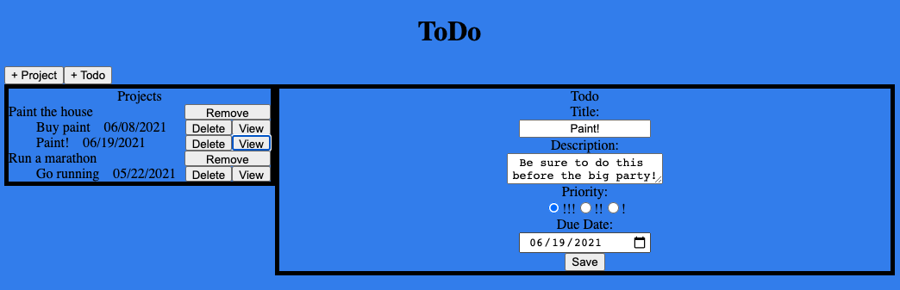

# Todo-List

This todo project focuses on concepts such as npm, external libraries, DOM manipulation, and saving information to localStorage.

    

## Features

- Utilizes external libraries.
- Stores data in localStorage.
- Create projects to store your todo's in.
- Edit todo's.
- Deleting projects also deletes todo's.

## Demo

- https://cameronstamant.github.io/Todo-List/
